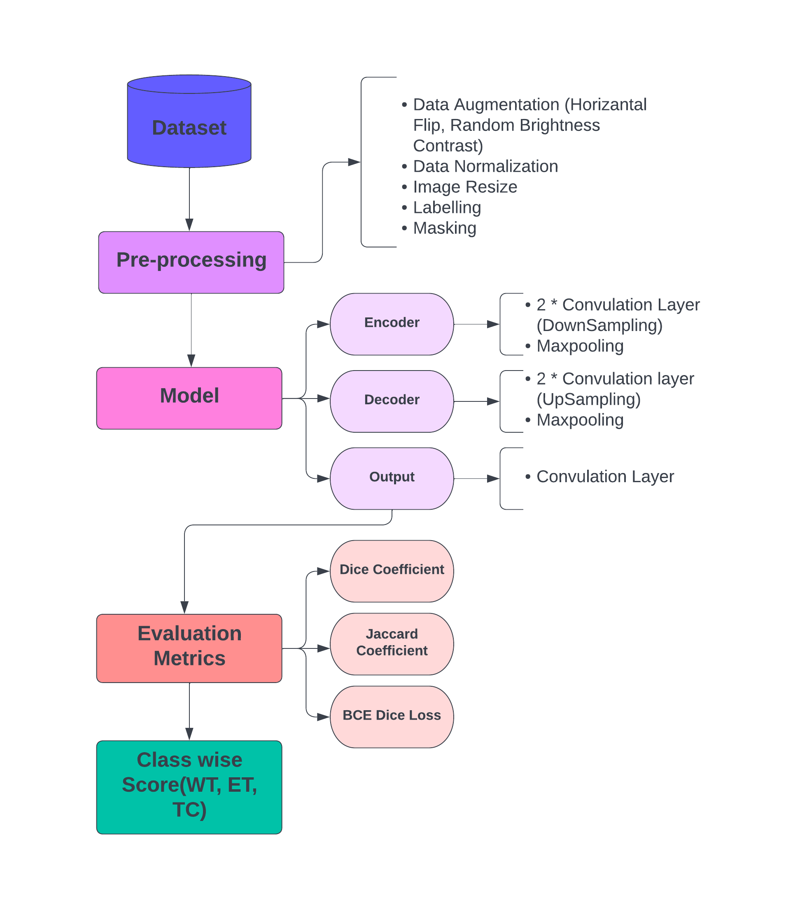
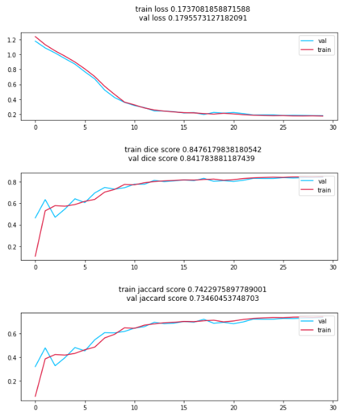
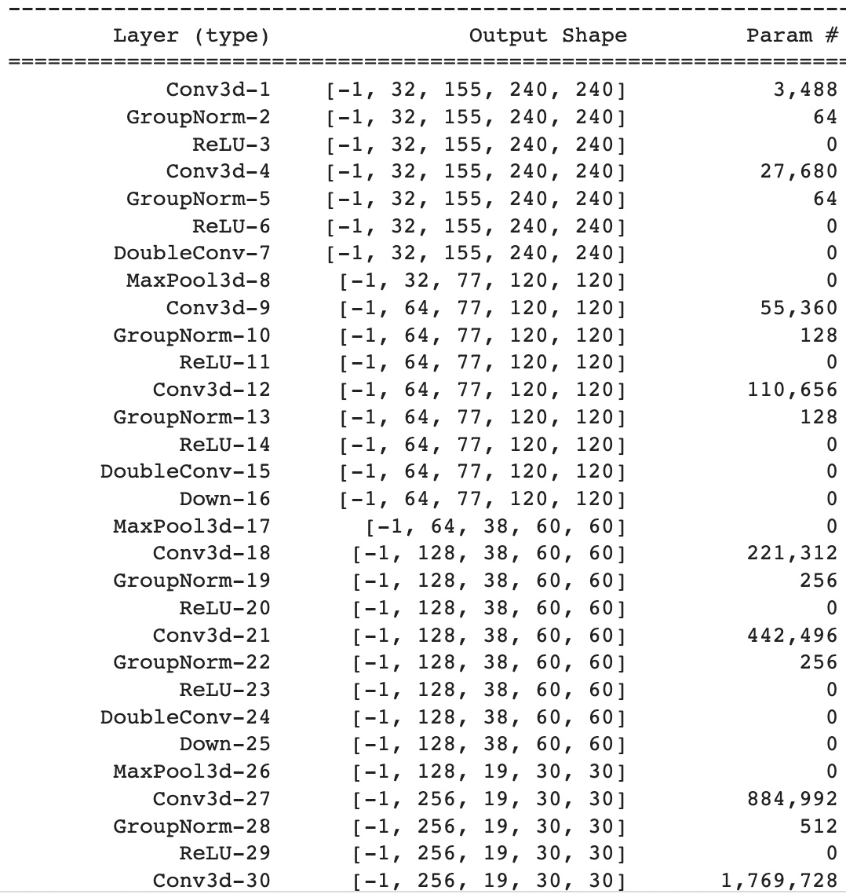
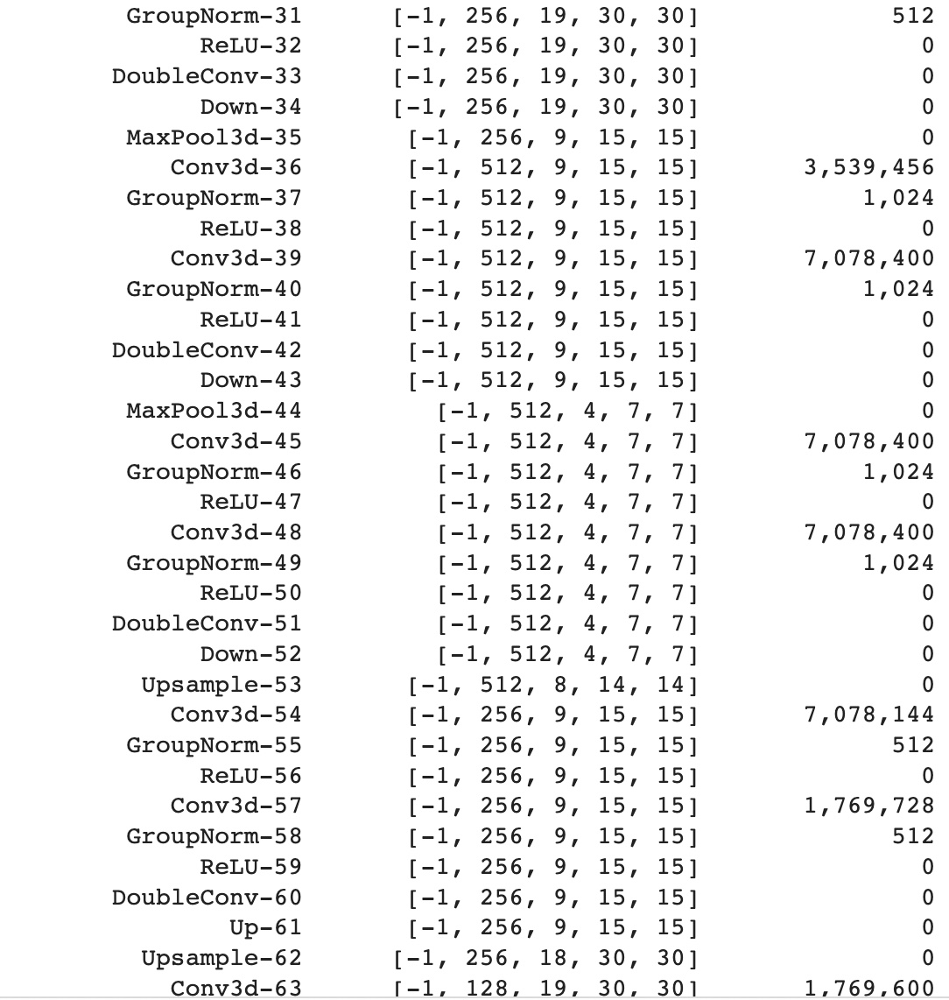
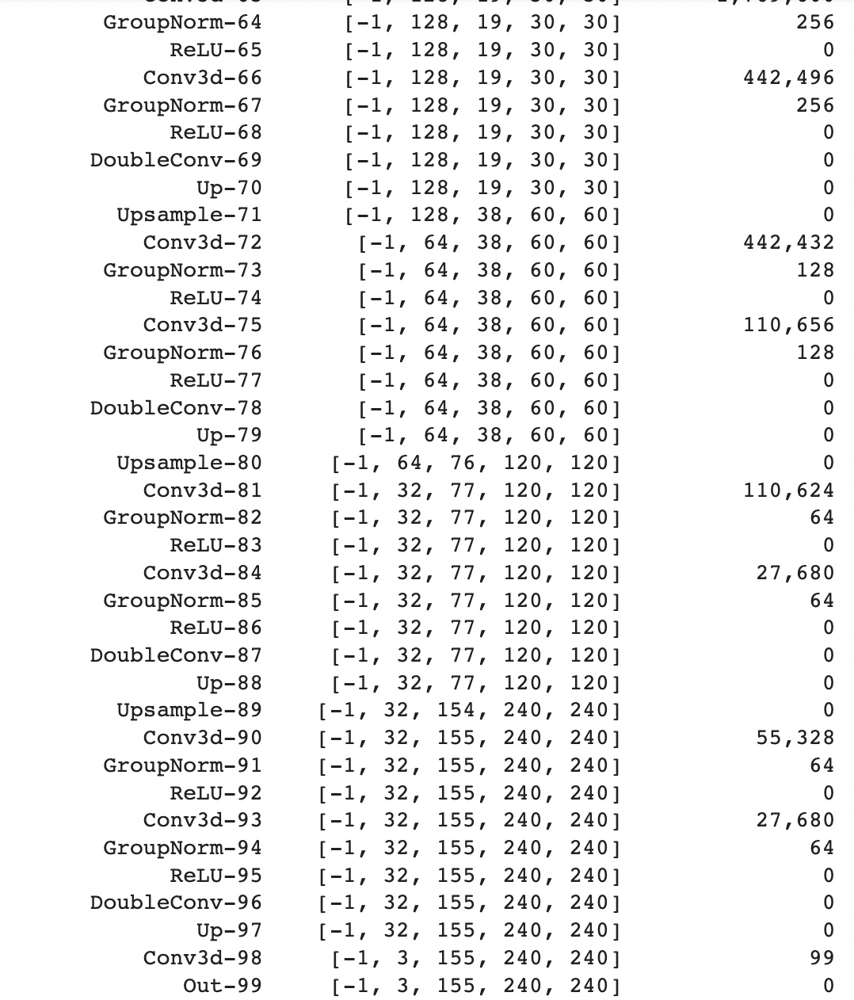
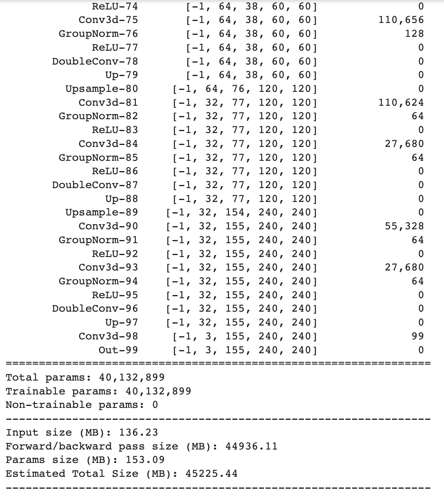
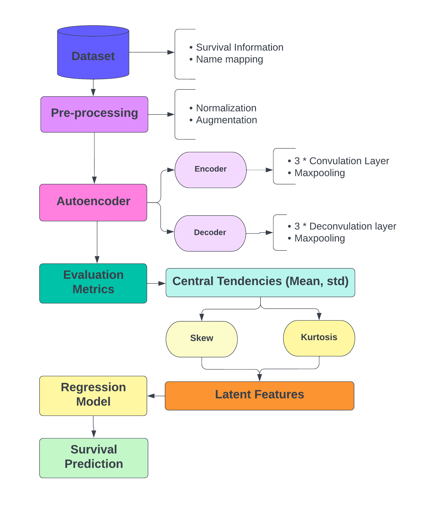
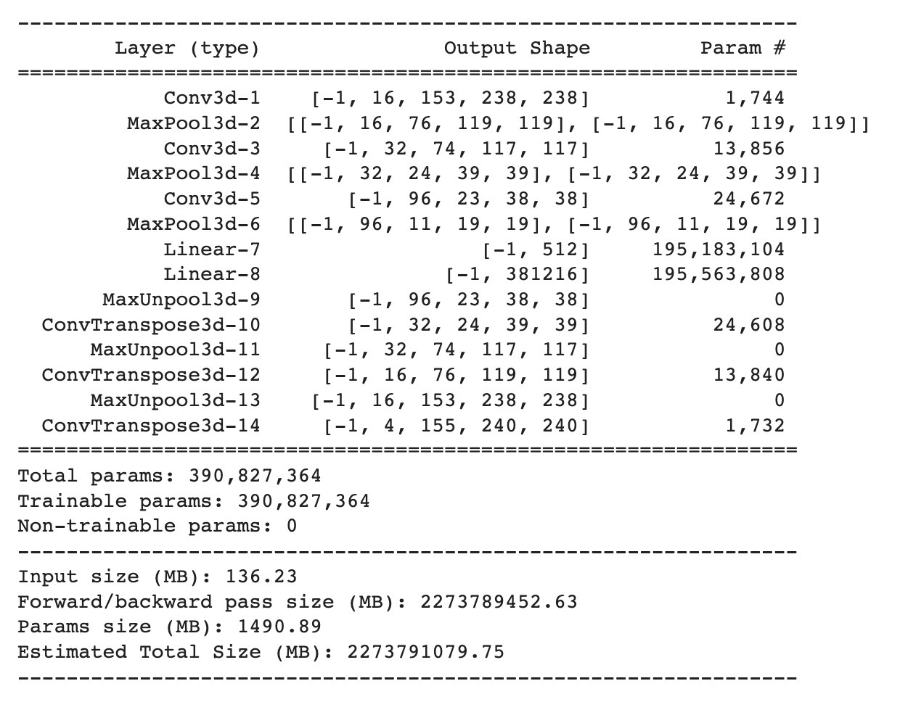
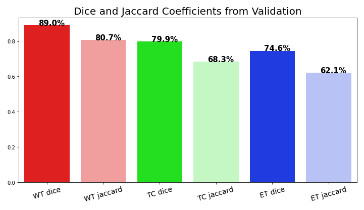

# Brats_2020_3DUnet [](https://www.python.org/downloads/release/python-360/)  
## Description 
The assessment of cutting-edge techniques for the segmentation of brain tumors in multimodal magnetic resonance imaging (MRI) images has always been the main emphasis of BraTS. Pre-operative MRI images from many institutions are used in BraTS, which principally focuses on the segmentation (Task 1) of gliomas, which are fundamentally diverse (in appearance, form, and histology) brain tumors. Furthermore, BraTS concentrates on the prediction of patient overall survival in order to emphasize the clinical importance of this segmentation challenge (Task 2), As our final year project we performed Brain Tumor segmentation and survival prediction using BraTS20 dataset. In this approach we proposed the 3D U-Net model for Image segmentation and for survival prediction task autoencoder model is used.

## Table of Contents

1. [Installation](#Installation)
2. [Usage_Description](#Usage-Description)
3. [Comparision/Results](Comparisions/Results)
4. [Acknowledgements](#Acknowledgements)
5. [Support](#Support)
6. [License](#License)
7. [Project Status](#Project-Status)


## Installation
### Libraries setup

Install the libraries as follows
```bash
pip install requirements.txt
```
**pip install nibabel**

an ever-expanding range of neuroimaging file formats are supported by NiBabel. Every file format has unique characteristics that must be taken into consideration if you want to get the most out of it. In order to achieve this, NiBabel provides high-level, format-independent access to neuroimages as well as an API with varying levels of format-specific access to all information that is accessible in a given file format. 

**pip install nilearn**

Analyses of brain volumes are now accessible and flexible thanks to Nilearn. It offers tools for machine learning and statistics, as well as helpful documentation. It utilises the scikit-learn Python toolbox for multivariate statistics and enables general linear model (GLM) based analysis with applications including predictive modelling, classification, decoding, or connection analysis.

**PyTorch**

To train the model and analyse the results, we employed torch in our methodology. PyTorch is an open source machine learning (ML) framework based on the Python programming language and the Torch library.

### Dataset:Google Drive Loading

Dataset can be downloaded from https://www.kaggle.com/datasets/awsaf49/brats20-dataset-training-validation

If using colab, after uploading mount the drive.

```bash
from google.colab import drive
drive.mount('./gdrive')
```
### Changing the global paths

Change the path to dataset and models in class GlobalConfig.

```bash
class GlobalConfig:
    root_dir = '/content/drive/MyDrive/final_dataset/FULL_BRATS_2020'
    train_root_dir = '/content/drive/MyDrive/final_dataset/FULL_BRATS_2020/BraTS2020_TrainingData/MICCAI_BraTS2020_TrainingData'
    test_root_dir = '/content/drive/MyDrive/final_dataset/FULL_BRATS_2020/BraTS2020_ValidationData/MICCAI_BraTS2020_ValidationData'
    path_to_csv = '/content/drive/MyDrive/final_dataset/train_data.csv'
```

## Usage-Description

---PROPOSED APPROACH OR FLOW OF PROGRAM---

### Dataset

All BraTS multimodal scans are available as NIfTI files (.nii.gz) and describe native (T1) and post-contrast T1-weighted (T1Gd), T2-weighted (T2), and d) T2-FLAIR volumes. They were acquired using various clinical protocols and scanners from multiple (n=19) institutions, which are mentioned as data contributors. All the imaging datasets have been segmented manually, by one to four raters, following the same annotation protocol, and their annotations were approved by experienced neuro-radiologists. Annotations comprise the GD-enhancing tumor (ET — label 4), the peritumoral edema (ED — label 2), and the necrotic and non-enhancing tumor core (NCR/NET — label 1). This dataset is made up of 3D MRI brain scans from 369 individuals with gliomas, 76 of them have LGG, and the remaining patients have HGG.

### Task 1


Task 1 is associated with brain tumor segmentation and to perform the brain tumor segmentation here in this approach we are using 3D U-Net model.

A convolutional neural network architecture called the U-Net is made for quick and accurate image segmentation. It is still one of the most widely used end-to-end designs in the semantic segmentation field since it has excelled in a number of tasks.

The network can be divided into two sections: the decoder path and the encoder path (backbone). The encoder uses a conventional stack of convolutional and max pooling layers to collect features in the images at various scales. The encoder uses two convolutional layers (k=3, s=1) repeatedly, each one being followed by a non-linearity layer and a max-pooling layer (k=2, s=2). To ensure that the network can successfully learn the complex structures, the number of feature mappings is doubled for each convolution block and its corresponding max pooling operation. For the proposed U-Net, we used 5 encoder layers and 5 decoder layers.

The decoder path employs transposed convolutions and is a symmetric expanding counterpart. This particular sort of convolutional layer performs the opposite of (down)pooling layers like the max pool and uses an up-sampling technique with trainable parameters. Each convolution block is followed by an up-convolutional layer, just like the encoder. Every block reduces the amount of feature maps by half. The feature maps of the relevant encoder block are appended to the output after each up-convolutional layer since it is challenging for the network to recreate a segmentation mask from a short feature map. In this case, the up sampling was done using the trilinear mode, and the down sampling was done using a sequential model with a max-pooling layer.

The output ends up going through a second convolution layer (k=1, s=1), with the number of feature mappings equal to the number of defined labels. 


#### Training Graphs 


#### 3DUNet Architecture 





### Task 2


In order to estimate a patient's overall survival, we intend to extract imaging/radiomic features from the brain tumour segmentation labels, combine them with the MRI data, and use machine learning algorithms to analyse the features.

Loading the dataset: We first create a list of the data with not null values of age and survival days, which can be utilized for the dataset's training and testing, and we put their individual addresses on a dataframe that the dataloader can access later to start the model training process.

Autoencoder model: An autoencoder is an unsupervised learning method for neural networks that trains the network to ignore signal "noise" as it discovers efficient data representations (encoding). The dataset will be encoded and decoded using an autoencoder model with the help of three convolutional layer layers and max - pooling. The encoder's outcome and the exact opposite of the decoder.

Training Parameter: We used Nvidia A100 40GB GPU for model training.
The learning rate for model training is set to 5e-4 and MSELoss criterion is used. We set the batch size to 3 and trained the model for 10 epochs.

Then, utilizing central tendencies like mean and standard deviation, we extracted additional latent features from the dataset like skew, kurtosis, and its variations like intense skew and non-intensive skew. Additionally, we normalized the features. With the creation of this new additional dataframe with latent features for each of the four modalities, a csv file is stored for future usage. After testing with various encoders, we settled on an encoder that has three convolutional layers, followed by three max - pooling layers. After training the dataset, we obtained a validation loss of 0.003 on average.




## Comparisions/Results

Unet Prediction

Following are the results as per Dice coefficient, Jaccard coefficient and BCE-Dice Loss(Binary Cross Entropy + Dice Coefficient Loss).



AutoEncoder Prediction

We have experimented with ElasticNet, SVR (Suppor Vector Regression), Random Forest Regression, and Gradient Boost. We found the Random Forest Regressor to be the best model for predicting survival rate after experimenting with various parameters and models. In order to calculate the patients' survival rate, we employed mean absolute percentage error (MAPE). The fact that there wasn't enough data provided for task 2 to be performed resulted in a lower overall MAPE of 0.311.


## Acknowledgements
We would like to express our gratitude to Dr. S. Mohammed to help us in our research and providing us valuable pointers for out project. We would also like to express our thanks to Peralman School of medicine, University of Pennysylvania for providing providing us the data needed for this project. Lastly we would also like express our gratitude to Lakehead University for facilliating this project as our final year project.

## License
This is open source project. Though it would be nice to give us message if find this project useful for your needs.

## Support
Feel free to contact me in case code has bugs. In fact I will very much appreciate for finding the faults in the code. Feel free to reach out to me. Though emails are the fastest ones I reply.

Connect: Yash Atul Patel  
Contact: yash9132@gmail.com 

Connect: KrushangBhavsar  
Contact: krushangbhavsar@gmail.com


Connect: Abhishek Shah  
Contact: abhishekshah1411@gmail.com

Connect: Arjunkumar Shah 
Contact: ashah25@lakeheadu.ca

Connect: Mohammed Hossein Ansari 
Contact: mansari2@lakeheadu.ca
